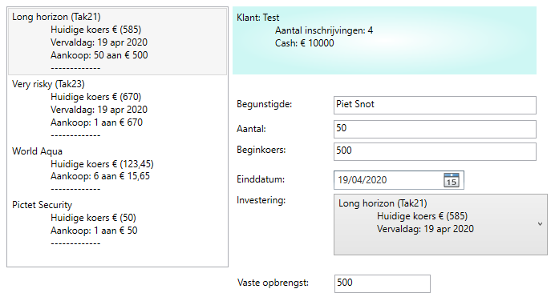
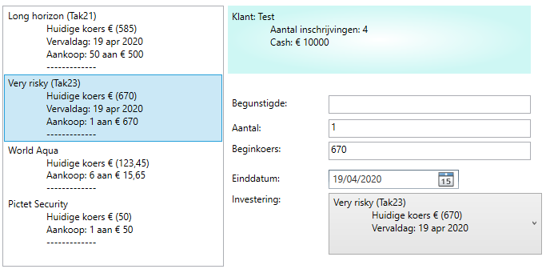
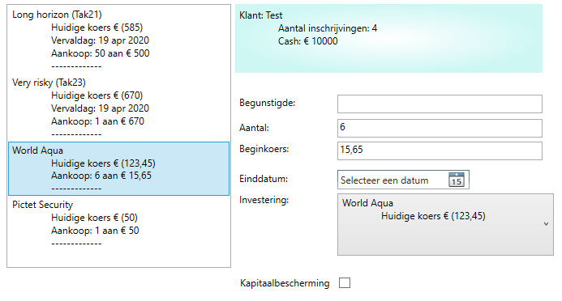

Werken met geavanceerde klassen en interfaces
# Beheer van een effectenportefeuille
Bekijk en beluister de PowerPoint om de structuur van de klassen te leren kennen.
[Powerpoint datastructuur](BeleggingenStructuur.ppsx)
De screenshots tonen de GUI al naargelang het type belegging er geselecteerd werd:

Fonds:

> Noot vooraf: 
> Zorg er bij de properties van je klassen voor dat er geen onzinnige gegevens opgeslagen kunnen worden. 
> Bij onzinnige waarden wordt een exception gegooid met een passende mededeling.
> Kies bij namen/omschrijvingen zelf een passend aantal karakters.

> Vraag bij de constructoren zo veel mogelijk parameters op. Voorzie bij bedragen code om willekeurige bedragen aan te maken als er bepaalde waarden doorgegeven worden via optionele parameters.

> Bekijk de screenshots om de override ToString in te stellen.

> Gebruik voor de berekening van willekeurige waarden steeds dezelfde instance van Random.

## Interface IInvestable
### Properties
- Koers: geldwaarde van het beleggingsproduct. 
  **Deze zal in de implementaties nooit kleiner mogen zijn dan nul.**
- Naam

### Method
- Wijzigkoers: methode om de koers van een beleggingsproduct te wijzigen op basis van een percentage.

## Implementaties van IInvestable
### TakVerzekering
Van deze klasse kunnen er geen instances aangemaakt worden, enkel van overervende klassen.
#### Bijkomende members
- EindDatum: als er geen einddatum wordt opgegeven, stel je die in op 31 dagen voor de systeemdatum. 

De koers wordt tussen 100 en 1000 ingesteld als er nul als waarde wordt doorgegeven bij het instantiëren.
### Fonds
#### Bijkomende members
- EindDatum: als er een einddatum wordt opgegeven, moet die minimum 12 maanden na de systeemdatum liggen. 
- KapitaalBescherming: bij een wijziging van de einddatum moet nagegaan worden of er kapitaalbescherming is. 
  De einddatum is bij kapitaalbescherming verplicht, anders niet.

De koers wordt tussen 500 en 1000 ingesteld als er nul als waarde wordt doorgegeven bij het instantiëren.

## Specifiëringen van de TakVerzekering
### Tak21
- Heeft alle members van de TakVerzekering.
#### Bijkomende members
- WinstDeling: berekend bij de verkoop ==> tussen 0 en 6 % (willekeurig berekend)
- VasteOpbrengst: vast bedrag, bepaald bij de instantiëring.
  Bedraagt 5 % van de beginkoers als er een waarde 0 wordt doorgegeven.
- GeefVerkoopWaarde: methode die de verkoopwaarde berekent => Koers + winstdeling + vaste opbrengst
### Tak23
- Heeft alle members van de TakVerzekering.
#### Bijkomende members
- BeursEvolutie: berekend bij de verkoop ==> max 10 % (positief of negatief, willekeurig berekend)
  Enkel te berekenen van binnen de klasse.
- VasteOpbrengst: vast bedrag, bepaald bij de instantiëring.
  Bedraagt 5 % van de beginkoers als er een waarde 0 wordt doorgegeven.
- GeefVerkoopWaarde: methode die de verkoopwaarde berekent => Koers + winstdeling + vaste opbrengst

## Andere entity classes
### Inschrijving
#### Members
- Investering (Fonds, Tak21 of Tak23): Mag niet null zijn.
- BeginKoers: minimum 10 euro.
- Aantal: aantal aangekochte investeringen (min. 1)
- Begunstigde: 
  - Als er niets (null) als waarde meegegeven wordt, wordt er een lege string ingevuld.
  - Als er een naam wordt meegegeven, moet die minstens 7 karakters lang zijn.
### KlantenPortefeuille
#### Members
- Id (Guid)
- NaamKlant
- Cash (enkel te wijzigen van binnen de klasse)
- Inschrijvingen: List van klasse Inschrijving
- VoerCashBewegingUit: vermeerdert of vermindert de property cash met het meegegeven bedrag.
  Als de cashbeweging ervoor zou zorgen dat de waarde van Cash onder de waarde van MinimumBedrag zakt, wordt er een exception gegooid. 
  
## Interface IInvestableBestand
### Property
- Effecten: List<IInvestable>

### Method
- LaadEffecten

### Implementatie
- MockDataEffecten: via LaadEffecten wordt Effecten geïnstantieerd met enkele voorbeeldobjecten) 

## Interface IPortefeuilleBestand
### Property
- Portefeuille: KlantenPortefeuille

### Method
- LaadPortefeuille: op basis van een instance van een klasse die IInvestableBestand implementeert.

### Implementatie
- MockDataPortefeuille: via LaadPortefeuille wordt een KlantenPortefeuille geïnstantieerd, met daarin enkele Inschrijvingen. De effecten van die inschrijvingen komen van een IInvestableBestand dat als parameter is meegegeven.

## BeheerEffecten
- Aanbod: de lijst van producten (Tak21, Tak23, Fonds) waaruit gekozen kan worden bij een investering.
- De constructor vraagt een IInvestableBestand als parameter.
- Bevat ook een random, die gebruikt wordt over de ganse library heen.

## BeheerPortefeuille
- Portefeuille: van de klasse KlantenPortefeuille(enkel aan te maken van binnen de klasse)
- De constructor vraagt een IPortefeuilleBestand als parameter.

## GUI
### Algemeen
Toon de inhoud van de klantenportefeuille in de GUI (zie screenshots).

### BepaalData
Maak een methode BepaalData, die ervoor zorgt dat basis van een parameter van het type DataSources, instances worden aangemaakt van BeheerEffecten en BeheerPortefeuille.

### VoerSpecifiekeTakenUit
Methode die de acties groepeert die specifiek zijn aan het type van investering dat geselecteerd werd in de listbox.
Bevat ook een call naar ToonGrid.

### ToonGrid
Op basis van het type van de gekozen inschrijving, worden grdFonds en grdTak21 getoond of verborgen.
